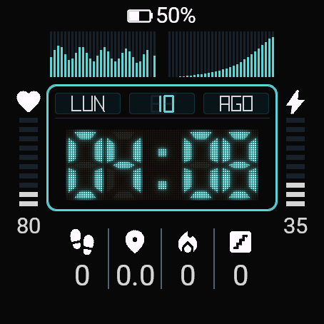
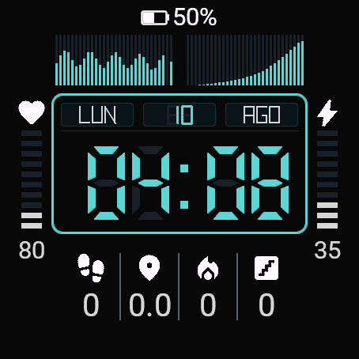
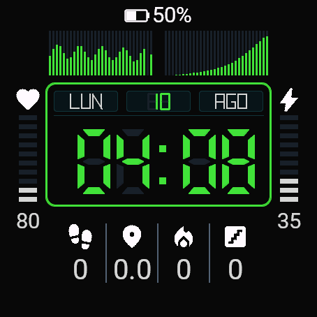
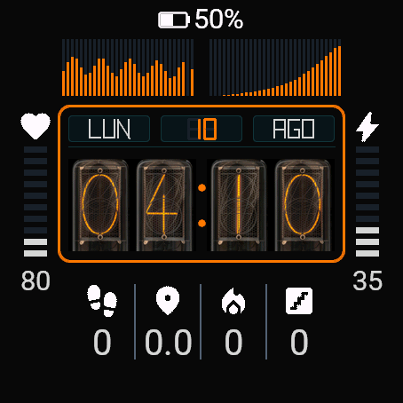
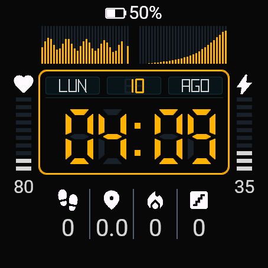
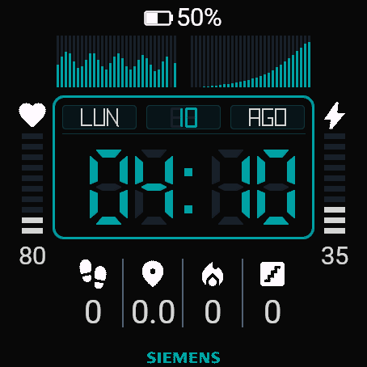
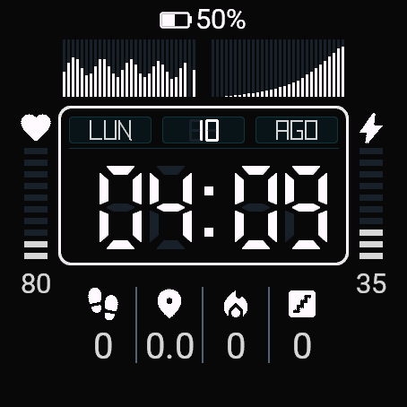

# REACTOR Watchface

**REACTOR** is a premium Garmin Connect IQ watchface for AMOLED smartwatches. It blends industrial brutalist aesthetics with retro design cues from Nixie tubes, LCD screens, and vintage control panels — without being a literal retro watchface.

## Screenshots

| VFD (Cyan) | LCD (Cyan) | LCD (Green Phosphor) |
|:---:|:---:|:---:|
|  |  |  |

| True Nixie (Amber) | LCD (Amber) | LCD (Siemens Blue) | LCD (White) |
|:---:|:---:|:---:|:---:|
|  |  |  |  |

## Features

- **Nixie Tube Digits**: Bitmap-rendered glowing cyan tubes for the main clock display, featuring a simulated wire mesh, light bloom, and unlit filament background for realism.
- **LCD Segment Digits**: Vector-drawn 7-segment renderers as an alternative solid style.
- **6 Color Themes**: Nixie Cyan, Sólido Cyan, Fósforo Verde, Ámbar, Blanco, Azul Siemens.
- **Dynamic Flank Gauges**: 10-segment LED-style vertical gauges (Heart Rate, Stress, Battery, Steps, Floors, Intensity Minutes, Body Battery, Phone Battery).
- **Dual Historical Charts**: Real-time bar charts showing Heart Rate and Body Battery trends.
- **Custom Vector Typography**: `CompactFont`, an entirely procedural geometric font for date windows and metrics.
- **Extremely Low Power**: Engineered with caching, layout isolation, and geometric primitive rendering for maximum AMOLED battery life.
- **AOD Support**: Automatic dim mode when the screen enters Always-On Display.

## Device Support

| Device | Status |
|---|---|
| Garmin Fenix 8 AMOLED (47mm) | ✅ Primary target |
| Garmin Epix Gen 2 / Pro | 🔄 Secondary |
| Garmin Enduro 3 | 🔄 Secondary |
| Garmin Tactix 8 AMOLED | 🔄 Secondary |

## Requirements

- **Connect IQ SDK** ≥ 9.2 ([Download](https://developer.garmin.com/connect-iq/sdk/))
- **macOS** (build scripts use bash/zsh)
- A Garmin AMOLED device or the Connect IQ Simulator

## Building & Running

### 1. Clone the repo

```bash
git clone https://github.com/Lechu77/reactor-watchface.git
cd reactor-watchface
```

### 2. Build

```bash
./scripts/build.sh
```

This compiles the project using `monkeyc` from your installed SDK and outputs `bin/reactor.prg`.

### 3. Run in the Simulator

```bash
./scripts/sim.sh
```

This starts the Connect IQ Simulator (if not already running) and loads the watchface for the Fenix 8 (47mm).

### 4. Switch Themes

```bash
./scripts/set_theme.sh
```

Running without arguments shows a help menu with all available themes:

```
  ╔══════════════════════════════════════════╗
  ║        REACTOR · Theme Switcher          ║
  ╠══════════════════════════════════════════╣
  ║  0 = Nixie (Cyan)           ██ bitmap   ║
  ║  1 = Sólido (Cyan)          ██ segment  ║
  ║  2 = Sólido (Fósforo Verde) ██ segment  ║
  ║  3 = Sólido (Ámbar)         ██ segment  ║
  ║  4 = Sólido (Blanco)        ██ segment  ║
  ║  5 = Sólido (Azul Siemens)  ██ segment  ║
  ╚══════════════════════════════════════════╝
```

Example: `./scripts/set_theme.sh 3` switches to Ámbar, recompiles, and relaunches.

## Installing on a Physical Watch

### Option A: Sideload via USB (Development)

Note: Recent macOS versions (including macOS 26) do not mount MTP devices as regular filesystems under `/Volumes`. Use a dedicated MTP tool (for example OpenMTP) to transfer the `.prg` file if your watch doesn't appear in Finder.

1. Build the `.prg` file:
   ```bash
   ./scripts/build.sh
   ```
2. Transfer the binary to the watch using one of these methods:
   - If the device mounts as a mass-storage volume (older models / Windows): copy to the device `GARMIN/APPS/` folder, e.g.
    ```bash
    cp bin/reactor.prg /Volumes/<DEVICE_NAME>/GARMIN/APPS/
    ```
   - If macOS does not mount it (macOS 26+), use OpenMTP (or another MTP client) to copy `bin/reactor.prg` into the watch filesystem (place in the APPS or GARMIN/APPS folder as shown by the client).

3. Safely disconnect (use the app's disconnect or eject the device) and unplug the cable.
4. On the watch: Settings → Watch Face → select **REACTOR**.

If the watch face does not appear after copying:
- Restart the watch and re-check the APPS folder with your MTP client.
- Verify that the file you copied is `bin/reactor.prg` (not `reactor.iq`).

### Option B: Connect IQ Store (Distribution)

1. Create a developer account at [developer.garmin.com](https://developer.garmin.com).
2. Package the app (release .iq signed with your developer key):
   ```bash
   monkeyc -f monkey.jungle -o bin/reactor.iq -e -y developer_key.der -r
   ```
   The signed package will be created at `bin/reactor.iq`.
3. Upload the `.iq` file to the Connect IQ Store (Developer Dashboard) and complete the app metadata and assets.
4. Users will be able to install the watch face from the Garmin Connect mobile app after publishing (or via a private/beta distribution if preferred).

### Notes
- For development rapid iteration, the Simulator (./scripts/sim.sh) is usually faster than sideloading to a device.
- `bin/reactor.prg` is the sideloadable runtime binary; `bin/reactor.iq` is the signed package for Store distribution.

## Project Structure

```
reactor-watchface/
├── source/
│   ├── ReactorApp.mc          # App entry point
│   ├── ReactorView.mc         # Main view & widget orchestrator
│   ├── data/
│   │   ├── DataProvider.mc    # Garmin sensor & activity data
│   │   └── MetricSlot.mc      # Dynamic metric slot configuration
│   ├── rendering/
│   │   ├── CompactFont.mc     # Procedural geometric vector font
│   │   └── SegmentRenderer.mc # 7-segment LCD digit renderer
│   ├── themes/
│   │   └── Theme.mc           # Color palette & theme configuration
│   └── widgets/
│       ├── HeaderWidget.mc    # Top battery & status bar
│       ├── ChartWidget.mc     # Dual historical bar charts
│       ├── TimeWidget.mc      # Main clock (Nixie or LCD)
│       ├── FlankWidget.mc     # Side LED gauge meters
│       └── BottomMetricsWidget.mc  # Bottom metric readouts
├── resources/
│   ├── drawables/             # Bitmap assets (VFD tubes, icons)
│   ├── settings/              # properties.xml & settings.xml
│   └── strings/               # UI string labels
├── scripts/
│   ├── build.sh               # Compile the project
│   ├── sim.sh                 # Launch in simulator
│   ├── set_theme.sh           # Switch theme & relaunch (cleans cache automatically)
│   ├── fix_svg_icons.py       # Utility to re-export SVGs to bypass OneDrive dataless lock
│   └── process_nixie_images.py # Utility to apply mesh/bloom texture to Nixie PNGs
├── manifest.xml               # App manifest (devices, permissions)
└── monkey.jungle              # Build configuration
```

## License

See [LICENSE](LICENSE) for details.
